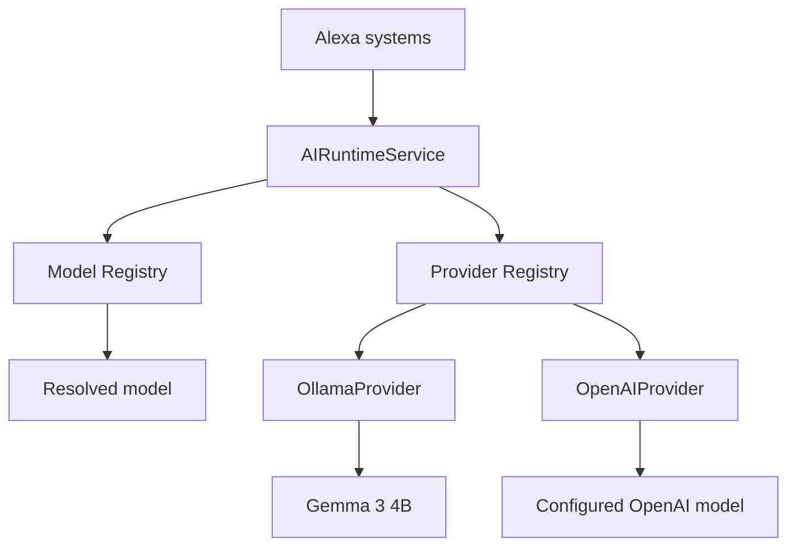

# Phase 20B AI Provider Runtime

Alexa calls `AIRuntimeService`, not vendor APIs. The runtime resolves an explicit
model selector or deterministic role mapping through `AIModelRegistry` and
`AIProviderRegistry`, validates declared capabilities, invokes a provider, and
returns normalized responses.

Provider adapters normalize errors and usage. API keys are server-side only;
provider descriptors expose only credential state. Model output remains
untrusted and structured output is validated locally with Zod.

Phase 20B deliberately does not implement automatic fallback, escalation,
budgeting, or task-complexity routing.
