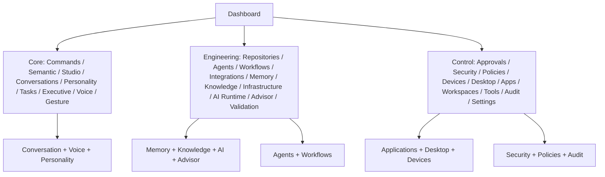
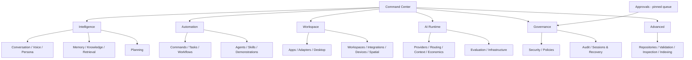

# Alexa UI Information Architecture Audit & Page Consolidation Plan

## 1. Executive Summary

The authenticated frontend exposes 32 meaningful routes through a three-bucket sidebar (`Core`, `Engineering`, `Control`). The navigation reflects implementation phases and backend subsystems rather than the owner's questions. Major problems are: 32 peer destinations, several overlapping operational centers, dashboard duplication, and no nested route/tab structure. The best future shape is seven primary workspaces plus a pinned Approvals queue; backend domains should remain separate.

## 2. Complete Current Page Inventory

| Page | Route | Domain | Purpose / primary data and actions | Current location |
|---|---|---|---|---|
| Dashboard | `/` | Command Center | System, security, device, repo, workflow, validation, integration and agent summaries; emergency stop. | Core |
| Commands | `/commands` | Automation | Submit structured intents; inspect intent/history; save commands and macros. | Core |
| Semantic | `/semantic` | Intelligence | Search registered semantic objects and retrieval history. | Core |
| Semantic Workspace | `/semantic-workspace` | Developer | Workspace intelligence/deep indexers; search and sync. | Core |
| Command Studio | `/command-studio` | Automation | Record demonstrations; generate, edit, validate and simulate commands/skills. | Core |
| Conversations | `/conversations` | Intelligence | Conversation history, topics, personas, feedback, bookmarks and routed replay. | Core |
| Personality | `/personality` | Intelligence / Advanced | Human-understanding profiles, corpus import/test and explanations. | Core |
| Tasks | `/tasks` | Automation | Create/trigger tasks, goals, routines and checklists. | Core |
| Executive | `/executive` | Intelligence / Automation | Priorities, decisions, reflection, skill evolution and skill benchmarks. | Core |
| Gesture Lab | `/gesture-lab` | Workspace | Spatial runtime, camera/gesture profiles and mappings. | Core |
| Voice | `/voice` | Intelligence | Persistent voice runtime, shortcuts and recent voice timeline. | Core |
| Repositories | `/repositories` | Developer | Code/repo index, search, architecture, engineering analysis, patch review. | Engineering |
| Agents | `/agents` | Automation | Agent registry/OS/society, teams, tasks, messages, consensus and workforce. | Engineering |
| Workflows | `/workflows` | Automation | Create, compose, approve, start, pause, recover and cancel workflows. | Engineering |
| Integrations | `/integrations` | Workspace | Integration health, permissions, capability explorer, dry-run operation log. | Engineering |
| Memory | `/memory` | Intelligence | Search, inspect provenance, preview context, pin/archive/restore/export. | Engineering |
| Knowledge Graph | `/knowledge-graph` | Intelligence | Personal graph, entity search and context resolution. | Engineering |
| Infrastructure | `/infrastructure` | AI Runtime / Advanced | Retrieval, vector/cache/worker health and embedding jobs. | Engineering |
| AI Runtime | `/local-ai` | AI Runtime | Providers, models, roles, routing, context, economics, budgets, activity, benchmarks and tests. | Engineering |
| Advisor | `/advisor` | Intelligence / Developer | Engineering goals, plans, simulations, roadmaps, risks, debt and release readiness. | Engineering |
| Validation | `/validations` | Developer | Trusted validation-profile plans/runs/history. | Engineering |
| Approvals | `/approvals` | Governance | Exact proposal queue; approve/reject/cancel and recent-auth flow. | Control |
| Security | `/security` | Governance | Network/readiness/sessions, emergency-stop release and recovery codes. | Control |
| Policies | `/policies` | Governance / Advanced | Non-executing policy simulation and policy-evaluation history. | Control |
| Devices | `/devices` | Workspace / Governance | Pair, approve and revoke trusted devices. | Control |
| Desktop | `/desktop` | Workspace | Semantic desktop context/navigation/interaction, skills, native providers and lifecycle. | Control |
| App Intelligence | `/application-intelligence` | Workspace | Resolve application semantic capabilities and select provider. | Control |
| Applications | `/applications` | Workspace | Application registry and adapter lifecycle, permissions, sync and SDK surfaces. | Control |
| Workspaces | `/workspaces` | Workspace / Governance | Register, update and disable trusted workspaces. | Control |
| Read-only tools | `/read-only-tools` | Developer | Bounded workspace/Git inspection plus execution provenance/history. | Control |
| Audit | `/audit` | Governance | Immutable security/audit event history. | Control |
| Settings | `/settings` | Governance | Session list and revocation. | Control |

There are no nested route pages today. The large panels inside Agents, Desktop, Executive, AI Runtime, Repositories, and Applications already behave as sub-pages and should become tabs/inspectors.

## 3. Current Functional Architecture

The app shell owns authentication, persistent voice, persistent spatial runtime, global command UI and a generic context rail. Each route uses React Query directly against owner-scoped API route families. Dashboard is a summary of health/system/security/devices/repositories/workflows/validations/integrations/agents. The largest backend families are deliberately distinct: conversation/voice/personality; memory/knowledge/learning; agents/workflows/tasks/skills; apps/adapters/desktop/spatial; AI runtime/economics/context/benchmarks; and security/policy/approval/audit.

## 4. Page-by-Page Explanation

- **Command Center:** answer “what is happening now?” with operational telemetry and an emergency-stop control; it should not be a second management console.
- **Conversation, Voice, Personality:** respectively inspect dialogue/feedback, operate the microphone runtime, and manage the deterministic human-understanding corpus. They form one owner-facing conversation experience with an advanced configuration tab.
- **Memory, Knowledge Graph, Semantic:** respectively manage remembered records, inspect entities/relationships, and retrieve registered semantic objects. They are one knowledge workspace with distinct views.
- **Commands, Command Studio, Tasks, Workflows, Agents, Executive:** respectively issue an intent, teach a skill, schedule/track work, orchestrate a plan, coordinate agents, and prioritize/learn from results. These are one automation lifecycle, not six unrelated sidebar choices.
- **Applications, App Intelligence, Desktop, Devices, Workspaces, Integrations, Gesture Lab:** define what trusted environment Alexa can understand or control. They belong together, while device identity remains security-sensitive.
- **AI Runtime and Infrastructure:** show/operate models, routing, context, cost, benchmarks, embeddings and substrate health. Infrastructure is an advanced tab, not an adjacent primary destination.
- **Repositories, Validation, Read-only Tools, Semantic Workspace, Advisor:** engineering/developer workbench functions. They serve an operator/developer, not the normal assistant owner.
- **Approvals, Security, Policies, Audit, Settings:** governance functions. Approval is a live queue; security posture, policy simulation, evidence and session settings are separate modes in the same governance workspace.

## 5. Overlap Analysis

| Pages involved | Shared function | Unique function | Overlap | Recommendation |
|---|---|---|---|---|
| Conversations, Voice, Personality | Interaction history and interpretation | microphone runtime; corpus administration | HIGH | Intelligence > Conversation; Voice and Persona tabs |
| Memory, Knowledge Graph, Semantic | Retrieval/context/explainability | lifecycle management; graph; registered-object lookup | HIGH | Intelligence > Knowledge workspace tabs |
| Commands, Command Studio, Tasks, Workflows, Agents | Turning a goal into governed work | command teaching, schedules, orchestration, multi-agent coordination | VERY_HIGH | Automation workspace tabs |
| Executive, Advisor, Skill Evolution/Reflection panels | Priorities, plans, decisions, risk and learned improvements | engineering advisory versus owner operating priorities | HIGH | Intelligence > Planning, with Skill lifecycle in Automation |
| Applications, App Intelligence, Desktop | Capability discovery and trusted semantic control | registry/adapters; resolution; desktop interaction | VERY_HIGH | Workspace > Apps & Desktop tabs |
| Devices, Gesture Lab, Desktop | trusted local interaction surfaces | identity; camera/gesture; semantic desktop | MEDIUM | Workspace with identity boundary shown in Governance |
| AI Runtime, Infrastructure | health, context, models and performance | provider economics versus cache/vector/worker substrate | HIGH | AI Runtime > Overview/Context/Operations tabs |
| Repositories, Validation, Read-only Tools, Semantic Workspace | registered-workspace inspection and engineering evidence | code analysis, fixed validations, bounded reads, deep index | HIGH | Advanced > Engineering workbench |
| Security, Policies, Audit, Settings | authorization posture and historical evidence | recovery/network; simulation; immutable records; session management | MEDIUM | Governance workspace tabs; Approvals remains pinned |
| Benchmarks in AI Runtime and Executive | evaluation history | runtime quality vs skill lifecycle quality | MEDIUM | one Evaluation Center with filtered suites and links back to domain detail |

## 6. Recommended Page Merges

**A. Intelligence Center** absorbs Conversations, Voice, Personality, Memory, Knowledge Graph, Semantic, Executive and the planning-facing portion of Advisor. Tabs: Now, Conversation, Voice, Persona, Memory, Knowledge Graph, Retrieval, Planning. Keep backend services separate.

**B. Automation Center** absorbs Commands, Command Studio, Tasks, Workflows, Agents and the skill-evolution portion of Executive. Tabs: Queue, Commands, Tasks, Workflows, Agents, Skills, Demonstrations, Schedules. Executive goals link into this center; no generic executor is introduced.

**C. Workspace Center** absorbs Applications, App Intelligence, Desktop, Integrations, Workspaces, Devices and Gesture Lab. Tabs: Overview, Applications, Adapters, Desktop, Workspaces, Integrations, Devices, Spatial. Device pairing/revocation retains recent-auth/governance controls.

**D. AI Runtime Center** retains AI Runtime and absorbs Infrastructure. Tabs: Overview, Providers & Models, Routing, Context, Economics, Activity, Evaluation, Infrastructure. This is primarily advanced administration.

**E. Governance Center** absorbs Security, Policies, Audit and Settings. Tabs: Security Posture, Policies, Audit, Sessions & Recovery. Approvals is a dedicated/pinned urgent queue that deep-links into Governance evidence.

**F. Advanced Engineering Workbench** absorbs Repositories, Validation, Read-only Tools, Semantic Workspace, and engineering-specific Advisor detail. Tabs: Repositories, Analysis, Patches, Validation, Inspection, Workspace Index, Engineering Advisor.

## 7. Pages to Keep Separate

- **Approvals:** live, bounded owner-decision queue; merging it into audit or policy simulation would hide urgent work.
- **Command Center:** summary/triage only; it should not become the data-heavy version of every other workspace.
- **AI Runtime:** expensive/provider/cost operations deserve a clear advanced boundary separate from ordinary assistant use.
- **Advanced Engineering Workbench:** repository inspection and validation should not burden daily personal-assistant navigation.
- **Authentication:** remains outside the authenticated shell.

## 8. Pages to Eliminate

| Current page | Replacement | Preserve |
|---|---|---|
| Voice | Intelligence > Voice | persistent-runtime controls, shortcuts and diagnostics |
| Personality | Intelligence > Persona (Advanced) | corpus import/test/profile simulation |
| Knowledge Graph | Intelligence > Knowledge Graph | entity/context exploration |
| Semantic | Intelligence > Retrieval | registered semantic object search/history |
| Command Studio | Automation > Demonstrations | recording, workflow editing and simulation |
| Tasks | Automation > Tasks | goals/routines/checklists |
| App Intelligence | Workspace > Applications > Capability Resolution | provider selection evidence |
| Gesture Lab | Workspace > Spatial | camera-local runtime diagnostics/mappings |
| Infrastructure | AI Runtime > Infrastructure | embedding/cache/vector/worker detail |
| Policies | Governance > Policies | non-executing simulator/evaluation history |
| Settings | Governance > Sessions & Recovery | revoke-session control |
| Validation, Read-only Tools, Semantic Workspace | Advanced > Engineering tabs | all bounded, governed inspection controls |

“Eliminate” means remove the standalone route after its functionality is represented by a tab, not delete services or data.

## 9. Proposed Super-Pages

| Super-page | Question answered | Tabs / function | Absorbs |
|---|---|---|---|
| Command Center | What is Alexa doing now? | Status, active work, alerts, approvals preview, quick command | Dashboard |
| Intelligence | What does Alexa know, understand and plan? | Now, Conversation, Voice, Persona, Memory, Knowledge, Retrieval, Planning | Conversations, Voice, Personality, Memory, Knowledge, Semantic, Executive, Advisor planning |
| Automation | What can Alexa do and what is running? | Queue, Commands, Tasks, Workflows, Agents, Skills, Demonstrations, Schedules | Commands, Command Studio, Tasks, Workflows, Agents, Executive skills |
| Workspace | What trusted environment can Alexa interact with? | Apps, Adapters, Desktop, Workspaces, Integrations, Devices, Spatial | Applications, App Intelligence, Desktop, Workspaces, Integrations, Devices, Gesture Lab |
| AI Runtime | What powers Alexa and what does it cost? | Providers, Routing, Context, Economics, Activity, Evaluation, Infrastructure | AI Runtime, Infrastructure |
| Governance | What is Alexa allowed to do and what happened? | Security, Policies, Audit, Sessions & Recovery | Security, Policies, Audit, Settings |
| Advanced | How is the engineering platform behaving? | Engineering Workbench and diagnostics | Repositories, Validation, Read-only Tools, Semantic Workspace, Advisor detail |

## 10. Proposed Top-Level Navigation

1. Command Center
2. Intelligence
3. Automation
4. Workspace
5. AI Runtime
6. Governance
7. Advanced

Pin **Approvals** above the list when pending, with a count badge. That creates eight visible destinations only when a dedicated approval queue is needed.

## 11. Home / Command Center Recommendation

Keep it a summary surface: Alexa runtime/listening state, current conversation/task/workflow, active agents, top executive priority, pending approvals, security/emergency status, provider/model health, actionable alerts, recent activity, and a real quick-command box. Remove detailed repo, validation, integration and device management from Home; use links to their owning tabs instead. Preserve the emergency stop as a guarded, conspicuous action.

## 12. User vs Advanced / Developer Pages

**Daily:** Command Center, Intelligence, Automation, Workspace, Approvals. **Advanced administration:** AI Runtime and Governance. **Developer/diagnostic:** Repositories, validation profiles/runs, read-only inspection, workspace indexers, provider traces, corpus import/testing, adapter SDK and infrastructure. The current shell puts many developer surfaces beside everyday conversation controls; that is the core usability problem.

## 13. Current Architecture Diagram



## 14. Proposed Architecture Diagram



## 15. Current → Proposed Migration Matrix

| Current | Proposed location | Action |
|---|---|---|
| Dashboard | Command Center | KEEP |
| Commands; Command Studio; Tasks; Workflows; Agents | Automation tabs | MERGE |
| Executive | Intelligence > Planning and Automation > Skills | SPLIT/MERGE |
| Conversations; Voice; Personality | Intelligence > Conversation/Voice/Persona | MERGE |
| Memory; Knowledge Graph; Semantic | Intelligence > Memory/Knowledge/Retrieval | MERGE |
| Applications; App Intelligence; Desktop | Workspace > Apps/Adapters/Desktop | MERGE |
| Workspaces; Integrations; Devices; Gesture Lab | Workspace tabs | MERGE |
| AI Runtime; Infrastructure | AI Runtime tabs | MERGE |
| Security; Policies; Audit; Settings | Governance tabs | MERGE |
| Approvals | Pinned Approvals queue | KEEP SEPARATE |
| Repositories; Validation; Read-only Tools; Semantic Workspace; Advisor | Advanced > Engineering Workbench | MOVE_TO_ADVANCED / MERGE |

## 16. Consolidation Priority Ranking

| Priority | Merge | Impact | Difficulty | Risk | Coupling |
|---|---|---|---|---|---|
| 1 | Conversation + Memory + Knowledge | HIGH | MEDIUM | LOW | UI composition/routing |
| 2 | Automation lifecycle | VERY_HIGH | HIGH | MEDIUM | Shared client state/deep links |
| 3 | Applications + Desktop + Devices | HIGH | HIGH | MEDIUM | Dense panels and safety labels |
| 4 | Governance + pinned approvals | HIGH | MEDIUM | MEDIUM | Preserve recent-auth/urgent queue |
| 5 | AI Runtime + Infrastructure + Evaluation | HIGH | MEDIUM | LOW | UI tabs/filters |
| 6 | Advanced Engineering Workbench | MEDIUM | MEDIUM | LOW | UI route consolidation |
| 7 | Home reduction/quick command | HIGH | MEDIUM | MEDIUM | Requires actual command entry UX |

## 17. Backend/API Impact

All recommended merges can begin as **UI-only** route and composition work: render existing page panels behind tabs, retain React Query keys/API calls, and preserve each backend route/service/store. A later optional API aggregation layer may reduce Home/center fan-out, but it is not required. Risks are client state preservation during tab/deep-link transitions; keep direct URLs as redirects during migration. Do not merge memory, knowledge, learning, agent, workflow, desktop, security, economics, or audit backend services merely because their UI becomes one workspace.

## 18. Final Recommended Alexa Layout

```text
Alexa
├── Command Center
├── Intelligence
│   ├── Now / Planning
│   ├── Conversation / Voice / Persona
│   └── Memory / Knowledge / Retrieval
├── Automation
│   ├── Queue / Commands / Tasks
│   ├── Workflows / Agents
│   └── Skills / Demonstrations / Schedules
├── Workspace
│   ├── Applications / Adapters / Desktop
│   └── Workspaces / Integrations / Devices / Spatial
├── AI Runtime
│   ├── Providers / Routing / Context / Economics
│   └── Activity / Evaluation / Infrastructure
├── Governance
│   ├── Security / Policies
│   └── Audit / Sessions & Recovery
├── Advanced
│   └── Engineering Workbench / Diagnostics
└── Approvals (pinned whenever pending)
```
