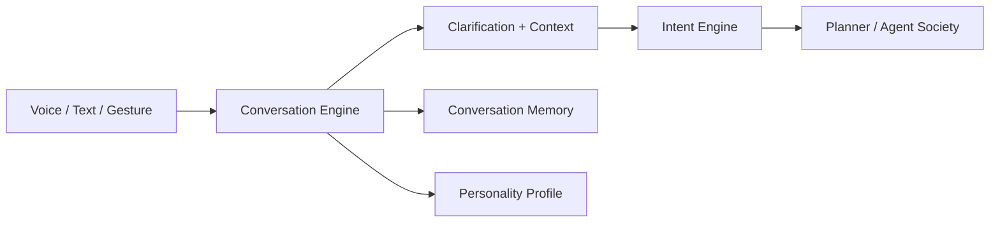

# Conversational Intelligence

Phase 15B layers conversational intelligence over the Voice Operating System.
It does not replace voice, intent, planning, memory, agents, or execution.

## What it stores

The conversation layer stores owner-scoped metadata:

- conversation sessions
- topics and topic transitions
- goals
- clarification history
- summaries
- personas
- context snapshots
- analytics
- bookmarks

It does not store raw audio and does not expose hidden reasoning.

## Clarification behavior

Ambiguous utterances such as “do that again” or “use the previous one” are
converted into clarification records instead of executable commands. The
assistant asks a targeted question and waits for additional context.

## Personas

Personas control response style only. They can influence vocabulary, sentence
length, humor, formality, question style, and future prosody settings. Personas
do not grant permissions, execution authority, approval rights, or access to
additional data.

## Governance

Conversation intelligence remains advisory/contextual. When a conversation
becomes actionable, it must route through the existing Intent Engine and all
normal planning, policy, approval, audit, and emergency-stop controls.
