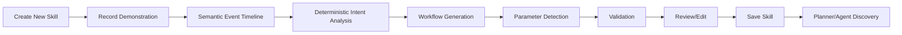

# Demonstration Learning Engine

Phase 17D turns semantic demonstrations into reusable, review-required skills.
It builds on Intent Recording, Semantic Desktop Model, Desktop Navigation,
Semantic Interaction, Planner, Command System, policy, approval, and audit.

This is not macro recording. The engine learns semantic intent, not mouse
movement.

Recorded:

- application opened or focused
- window focused
- panel selected
- button clicked
- field updated
- dropdown selected
- checkbox toggled
- menu opened
- dialog confirmed
- form submitted
- wait condition
- planner, capability, command, gesture, and voice invocation

Never recorded:

- mouse coordinates
- screen pixels
- screenshots
- raw keyboard events
- raw camera frames
- raw audio
- OCR or computer-vision payloads
- passwords, tokens, cookies, secure text, authentication codes, or secrets

## Pipeline

Generated skills remain inert until saved after review. Saving a skill does not
grant execution authority; later execution must route through the existing
Intent Engine, Planner, Desktop Capability Layer, policy, approval, and audit.
