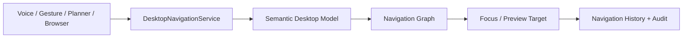

# Semantic Desktop Navigation Engine

Phase 17B adds deterministic navigation over the Phase 17A Semantic Desktop
Model. The engine understands registered applications, windows, panels, and
controls as semantic objects, then moves focus or previews targets without
performing any interaction.

Flow:

## What it does

- builds an owner-scoped navigation graph from registered semantic objects;
- supports deterministic search by label, alias, role, and current context;
- previews/highlights a target object;
- updates semantic focus metadata;
- records focus history, navigation history, window navigation, events, metrics,
  and audit entries;
- exposes the Desktop Navigation Center in the web dashboard.

## What it does not do

The engine is read-only. It must not click buttons, type text, activate
controls, submit forms, toggle switches, launch applications, move windows, run
shell commands, call AppleScript, or use unrestricted Accessibility APIs.

Failed, hidden, unauthorized, secure, or low-confidence targets fail closed and
produce a safe navigation failure record instead of falling back to execution.

## API

`POST /api/desktop/navigation`

The request is authenticated, CSRF-protected, trusted-origin checked, and
validated with shared Zod schemas.

Supported actions:

- `preview_object`
- `focus_object`
- `navigate_to_object`
- `parent`
- `first_child`
- `last_child`
- `next_sibling`
- `previous_sibling`
- `back`
- `forward`

Every response includes explicit safety booleans:

- `readOnly: true`
- `activatedControl: false`
- `typedText: false`
- `clickedButton: false`

Those fields are intentional guardrails for future interaction phases.
