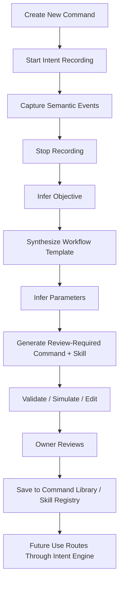

# Intent Recording and Demonstration Learning

Phase 16 adds Command Studio, a governed semantic intent-recording layer.
Phase 17D extends it into Demonstration Studio: semantic programming by
demonstration that generates reusable workflow timelines and review-required
skills rather than replaying low-level input.

## Security model

Intent Recording is not a macro recorder. It never stores raw mouse paths,
keyboard streams, camera frames, microphone audio, pixels, passwords, cookies,
tokens, recovery codes, MFA values, or unrestricted browser/document content.
Phase 17D also rejects coordinate, screenshot, OCR, computer-vision, raw
keyboard, raw audio, raw camera-frame, and secure-text payload keys before
persistence.

Every recorded event is a bounded owner-scoped semantic record:

- source, such as `dashboard`, `voice`, `gesture`, `browser_capability`, or
  `desktop_capability`
- event type, such as `intent_submitted` or `capability_invoked`
- optional registered capability ID
- redacted structured arguments
- status, dependency IDs, timing, and a human-readable summary

Secret-like argument keys are denied before persistence. Generated commands and
demonstrated skills are created with `review_required` status and are inert
until explicitly saved by the owner. Saved commands and skills still route
through the existing Intent Engine, Planner, policy, approval, audit, and
emergency-stop systems.

## Flow

## Command Studio

The web dashboard exposes Command Studio at `/command-studio`.

It provides:

- recording lifecycle controls
- semantic event timeline
- generated workflow timeline
- generated command review
- generated skill review
- skill registry
- inferred parameter preview
- workflow validation and simulation
- workflow editor metadata
- command version records
- dependency records
- analytics records
- advisory optimization suggestions

## Backend components

- `IntentRecordingService`
- `IntentRecordingStore`
- `PostgresIntentRecordingStore`
- Command Studio routes under `/api/command-studio`
- PostgreSQL migration `0030_phase_16_intent_recording.sql`
- PostgreSQL migration `0035_phase_17d_demonstration_learning.sql`

## Data model

Phase 16 adds tables for:

- `intent_recordings`
- `recorded_events`
- `workflow_templates`
- `generated_commands`
- `command_parameters`
- `command_versions`
- `workflow_analytics`
- `demonstration_sessions`
- `optimization_suggestions`
- `command_dependencies`

Phase 17D adds tables for:

- `semantic_recordings`
- `workflow_timelines`
- `generated_skills`
- `skill_parameters`
- `skill_versions`
- `skill_usage`
- `workflow_validation`
- `workflow_conditions`
- `workflow_dependencies`

PostgreSQL remains the source of truth in production.

## Current limitation

The recording runtime accepts semantic events from governed surfaces and exposes
a dashboard test path for recording safe semantic notes. Passive capture from
every desktop/browser provider depends on those providers emitting registered
semantic capability events; raw OS input capture remains intentionally absent.
