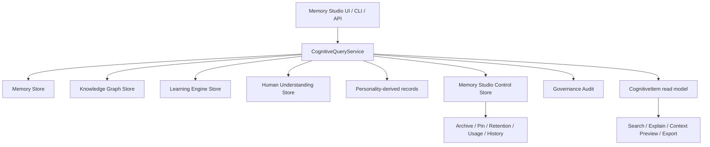

# Phase 19D Implementation Report

## Delivered

- Shared Memory Studio schemas in `packages/shared`.
- Unified `CognitiveItem` read model over memory, knowledge graph, learning,
  personality, Human Understanding, semantic examples, and embedding metadata.
- In-memory and PostgreSQL stores for Studio controls, usage, versions, and
  audit links.
- Migration `0052_phase_19d_memory_studio.sql`.
- `CognitiveQueryService` with dashboard, search, inspect, explain, provenance,
  usage, history, related, retention, archive, pin, merge preview, delete impact
  preview, context preview, export, health, and embedding inspection.
- Authenticated `/api/memory-studio` routes with CSRF on mutations.
- Memory page upgraded into Memory Studio.
- Developer CLI commands for stats, search, inspect, health, conflicts, stale,
  duplicate hints, validation, reindex preview, export, and cleanup advice.
- Focused regression tests for search, explanation, metadata controls, delete
  preview, context preview, and owner isolation.

## Architecture

## Security Posture

- No second memory database, vector database, graph store, learning engine,
  personality store, planner, or executor.
- No LLM-dependent inspection or reasoning requirement.
- No raw vector exposure.
- No permanent deletion.
- Merge and reindex are preview or metadata-only operations.
- Cognitive items never authorize execution or approvals.
- Mutations remain authenticated, trusted-origin, CSRF-guarded, owner-scoped,
  auditable, and fail-closed.

## Known Limitations

- Split execution and canonical source mutation are intentionally not
  implemented in Phase 19D.
- Import is documented but not enabled pending source-specific governance.
- Embedding inspection reports metadata only; it does not run a vector rebuild.
- Duplicate detection is title-based CLI advice in this slice, not canonical
  merge automation.

## Phase 19 Status

Phase 19A Human Understanding, Phase 19B Personal Knowledge Graph, Phase 19C
Learning Engine, and Phase 19D Memory Studio are complete as an integrated,
owner-scoped cognitive foundation. The foundation remains advisory and
explainable, with all execution authority still routed through existing
governed systems.
