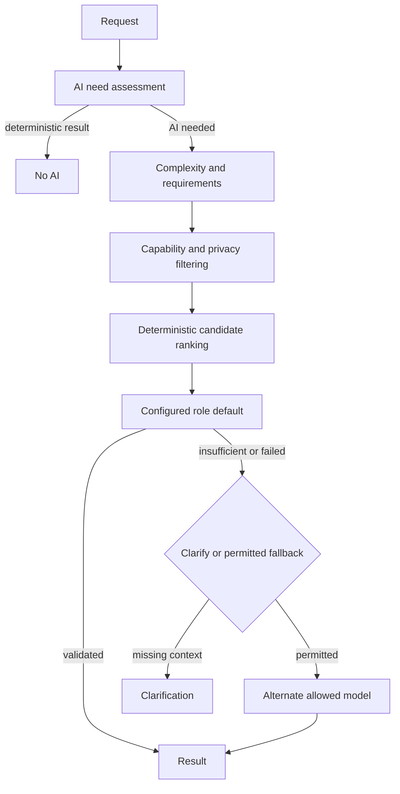

# Phase 20C — AI Router, Escalation Engine, and Intelligence Routing

Phase 20C adds one high-level `AIRouterService` above the Phase 20B provider and
model registries. High-level systems submit a purpose, bounded request, risk,
privacy/locality constraints, and optional role. They do not select vendors.

## Routing precedence

The router applies constraints in this order:

1. deterministic bypass and explicit safety/privacy constraints;
2. required capabilities and structured-output requirements;
3. explicit diagnostic model selector;
4. requested role;
5. purpose-to-role mapping;
6. deterministic complexity classification;
7. locality and latency preference;
8. candidate score;
9. bounded fallback chain.

`LOCAL_ONLY`, `NO_EXTERNAL`, and `allowCloud: false` remove remote candidates
before scoring. No fallback can override those constraints.

## Complexity and confidence

The classifier is deterministic and inspectable. It considers bounded input
length, context size, purpose, risk, and explicit multi-step/deep-reasoning
signals. It produces `LOW`, `MEDIUM`, `HIGH`, or `VERY_HIGH`; it does not call a
model to classify complexity.

Structured results are validated by the caller-provided Zod schema. Confidence
below the level threshold is not accepted. Ambiguous or very low-confidence
interpretation returns `CLARIFICATION_REQUIRED` when allowed; otherwise the
router may use a permitted fallback.

## Fallback, retry, and circuit protection

Attempts are capped at three, cloud escalations at one, and provider/model
retryable failures use a small in-memory circuit breaker. Open circuits are
temporarily excluded and recover on the next bounded health window. The router
records only bounded metadata: no prompts, secrets, or hidden reasoning.

## Human Understanding boundary

Human Understanding continues to run exact matches, aliases, patterns,
negative/non-execution rules, entities, context, and confidence first. Only its
`ai_router` band may invoke `AIRouterService` for a structured
`FAST_INTERPRETER` result. The result is placed back into planner input and does
not bypass intent validation or the governed Intent Engine. Negative corpus
matches never call the router.

## APIs and Studio

Authenticated owner-scoped diagnostics expose `/api/ai/router/simulate`,
`/api/ai/router/execute`, `/api/ai/router/execute-structured`,
`/api/ai/router/metrics`, and `/api/ai/router/events`. These endpoints
perform inference diagnostics only; they cannot execute capabilities. AI Runtime
Studio shows actual no-AI/local/cloud/escalation/clarification/retry/failure
counters and provider/model activity.

## Persistence and future phases

The Phase 20B registry migration remains the authoritative schema foundation for
provider/model/role/runtime records. Phase 20C route counters and circuit state
are intentionally process-local diagnostics and are not yet a monetary budget
or adaptive-learning system. Persistent routing policy, cost governance,
benchmark feedback, and outcome-driven adaptation remain later-phase work.
