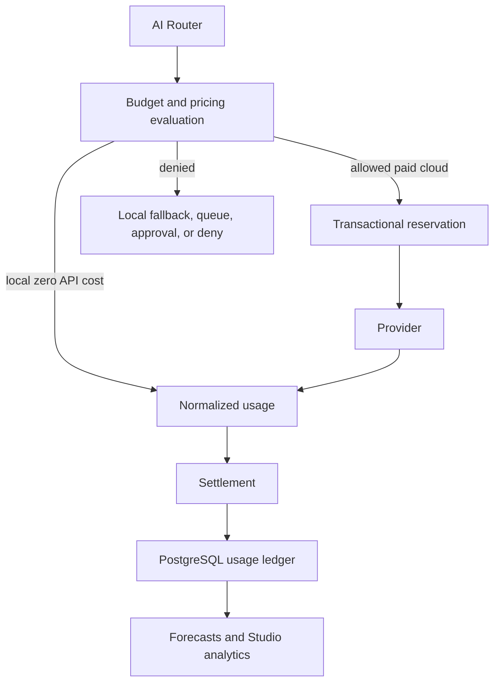

# Phase 20D — AI Economic Governance

Phase 20D adds economic controls above providers and below the Phase 20C router.
Providers report usage; they never decide whether spending is permitted.

Money is represented as decimal strings at API boundaries and persisted as
PostgreSQL `NUMERIC(20,8)`. Cost calculation uses scaled integer arithmetic:
uncached input tokens, cached input tokens, provider-normalized output tokens,
and request fees are priced against a versioned catalog. Reasoning tokens are
used as billable output only when the adapter does not report an inclusive
output total, preventing double charging.
Local inference records tokens and latency with zero API cost.

Every economic request carries owner, purpose, autonomy mode, priority, and
optional agent, department, workflow, workflow-run, task, conversation, and cost
center identifiers. Economics records never store prompts, responses, secrets,
or hidden reasoning.

Applicable global, provider, model, department, agent, workflow, and cost-center
policies are all evaluated. The narrowest remaining budget controls the request.
Cloud candidates without active pricing or an applicable durable policy fail
closed. Autonomous cloud work additionally requires agent or workflow identity;
autonomous workflows require a run ID. Reservations are created before a cloud
call and settled from normalized provider usage. Failed and cancelled calls
produce ledger rows and release reservations. Idempotency is bound to owner,
request, and attempt IDs.

Migration `0054_phase_20d_ai_economics.sql` creates pricing, budget policy,
reservation, and usage-ledger tables. Migration
`0056_phase_20r_b_durable_ai_economics.sql` adds attempt correlation, policy
bindings, scoped reservation context, call-count guards, cost-center indexes,
bounded override grants, and deterministic anomaly records.

PostgreSQL is authoritative whenever the application uses PostgreSQL stores.
`PostgresAIEconomicsStore.reserveAtomic` starts a transaction, locks active owner
policy rows in deterministic `scope, scope_id, id` order, reads settled usage and
active reservations under those locks, validates every applicable cap, and
inserts the reservation before committing. Two API processes therefore share
the same locking authority. Startup expires stale active reservations; there is
no process-memory fallback in PostgreSQL mode.

The runtime requires an active owner-bound reservation permit before invoking a
remote provider. Router failures and cancellations settle known usage or record
zero known cost and release the reservation. If actual cost exceeds the
reservation, financial truth is retained and an `OVER_RESERVATION` anomaly is
persisted.

The Studio exposes real overview values: month-to-date spend, remaining budget,
projected month-end spend, health, local/cloud request counts, and token totals.
Forecasts are explicitly estimates and do not claim provider invoice
reconciliation. System-global pricing is readable by authenticated owners but
is not mutable by ordinary owner API routes. New versions are installed through
trusted deployment administration. Budget removal disables the policy instead
of deleting governance history.

Phase 20E context compression and prompt caching strategy, and Phase 20F
benchmark-driven routing, are intentionally deferred.
