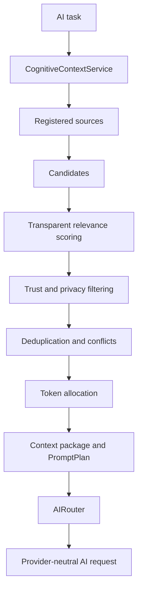

# Phase 20E — Cognitive Context Engine

Phase 20E introduces a centralized, provider-neutral context composition layer.
It composes bounded context packages from registered sources and existing Phase
19 state rather than creating another memory, graph, preference, or vector
database.

`CognitiveContextService` accepts owner, task, profile, explicit project,
workflow, agent and conversation scope, provider trust boundary, privacy and
model/economic token limits. Production bootstrap registers adapters over the
existing Phase 19 stores for Personality, Personal Knowledge Graph, Memory,
Learning, Human Understanding conversation state, repositories/projects,
workflows, agents, recent workspace/application activity, Semantic Workspace,
and current application state. The adapters do not create a second content
store. Every adapter receives an owner ID and ownerless registration is
rejected.

Candidates are scored deterministically from semantic word overlap (0.18),
entity match (0.08), freshness (0.12), importance (0.08), confidence (0.07),
source authority (0.18), explicit scope match (0.18), independent task
association (0.06), and profile source priority (0.05). Explicit mismatched
project, workflow, agent, or conversation scope is removed before ranking.
Operational sources receive shorter freshness windows than durable preference
or memory sources.

Canonical keys are source-independent. Equal facts merge while retaining all
bounded provenance references. Contradictory facts resolve only through a
material authority or freshness difference; otherwise they are omitted and
marked `UNRESOLVED` or `CLARIFICATION_REQUIRED`. Current Workflow and
Application State therefore outrank stale Memory for mutable state.

The allocator calculates cognitive capacity as model context window minus task
input, provider overhead, maximum output, reasoning reserve, and safety margin,
then applies the lower of the caller cap and economic maximum-input allowance.
Mandatory system boundaries are kept outside relevance pruning. The result
includes owner/request/context IDs, source statuses, component scores,
provenance, scope, authority, freshness, omission reasons, conflicts,
sufficiency, cacheability, and a provider-bound fingerprint. Estimation remains
conservative character-based accounting rather than an exact provider
tokenizer.

`AIPromptCompiler` converts a validated provider-neutral `AIPromptPlan` into the
canonical inference request. OpenAI transmits context as explicitly labelled
input data and keeps system instructions in the Responses API instruction
field. Ollama sends system instructions once through its system field and
labelled context through its prompt. External/tool/document content retains its
untrusted label.

AIRouter composes a fresh package inside every candidate attempt. A failed
local attempt followed by a cloud candidate therefore reruns scope and privacy
policy for the selected cloud provider/model; the local package is never
reused. `LOCAL_ONLY` excludes cloud at routing and composition boundaries.
Cloud composition denies `SECRET` and `RESTRICTED` by default and permits
`PRIVATE` only at an approved cloud trust boundary. Privacy filtering always
runs, even when model-window metadata is absent.

Authenticated diagnostics expose context composition/simulation, profiles,
owner-filtered trace metadata, and truthful health. Trace listings omit block
content; viewing one full trace requires an explicit owner-scoped lookup, uses
`Cache-Control: no-store`, and returns a privacy warning. Public dry-run input
accepts only owner-authored or external data and derives its trust label on the
server, so callers cannot declare system authority. In-memory full-trace
retention is capped at 100 packages. A trace lookup requires the authenticated
owner; another owner receives no trace. Runtime Studio shows
per-source health and a no-inference dry-run with selected/omitted blocks,
scores, scope, token allocation, conflicts, sufficiency, privacy, and
provenance. Newly registered but unprobed sources remain `DEGRADED` until a
bounded retrieval succeeds; health never assumes that registration means
runtime readiness. Raw expanded prompts are not logged or persisted by default.

Known limitations: Human Understanding history does not persist a conversation
ID, so an explicitly scoped conversation uses only exact agent-message records
and fails degraded rather than borrowing unrelated recent human turns. Context
traces remain bounded in process memory; durable
metadata-only trace persistence was not added. Context profiles remain
versioned system defaults rather than owner-editable records. Exact tokenizers,
LLM compression, adaptive ranking, automatic profile tuning, shadow traffic,
and broad benchmark optimization are deferred to Phase 20R-D.
