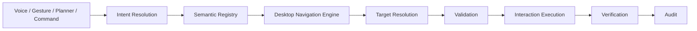

# Semantic Interaction Engine

Phase 17C adds deterministic semantic interaction on top of the Phase 17A
Semantic Desktop Model and Phase 17B Desktop Navigation Engine.

The core rule is: semantic interaction, not pixel automation.

The engine never accepts raw coordinates, screenshots, OCR payloads, computer
vision results, unrestricted Accessibility dumps, raw mouse input, raw keyboard
input, shell commands, AppleScript, executable paths, or unregistered
applications as authority.

## Pipeline

Every interaction follows the same bounded pipeline:

## Backend services

- `SemanticInteractionService` coordinates the pipeline.
- `TargetResolutionService` resolves registered semantic objects and rejects
  hidden, disabled, ambiguous, unsupported, or unauthorized targets.
- `FormInteractionService` decomposes form fills into ordered semantic actions.
- `FieldMatchingService` matches fields by labels, aliases, descriptions, tags,
  context, and hierarchy.
- `InteractionVerificationService` records verification for every action.
- Interaction history, failures, metrics, profiles, field mappings, semantic
  actions, and verification records are persisted and owner scoped.

## Provider boundary

All interactions are represented as Desktop Capability Layer actions. Metadata
preview actions such as `highlight`, `reveal`, `hover`, `focus`, and
`scroll_into_view` can complete through the metadata provider. Mutating native
interactions such as `click`, `set_value`, `toggle`, `choose`, and `submit`
require a reviewed healthy desktop provider and otherwise fail closed.

## API

- `POST /api/desktop/interactions`
- `POST /api/desktop/forms/fill`
- `GET /api/desktop`

All mutation endpoints require authentication, trusted origin, and CSRF
protection.
