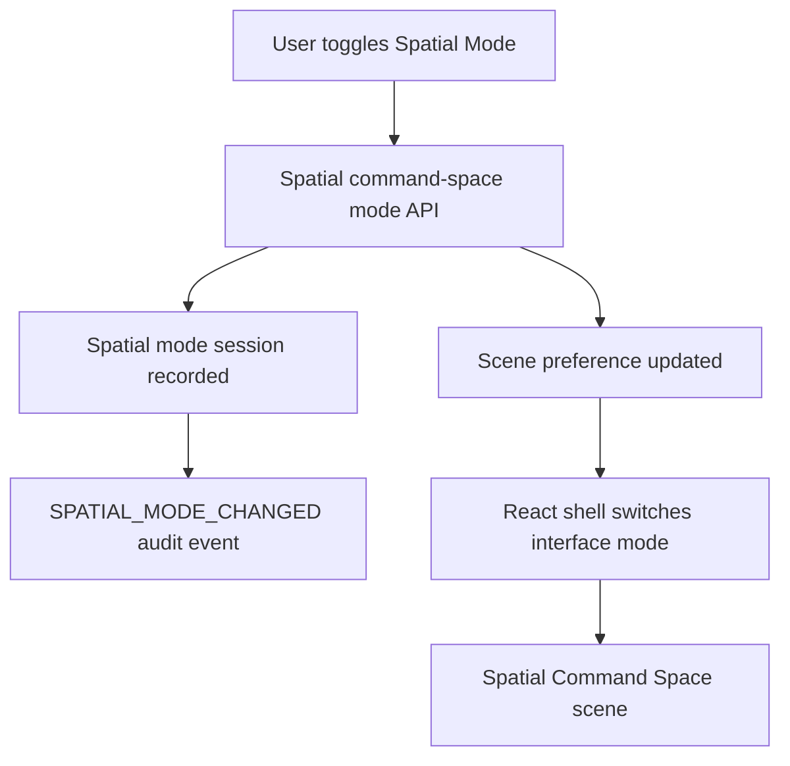

# Spatial Command Space

Phase 14F adds an optional Spatial Command Space alongside the standard
dashboard. It is a holographic operating environment for visualizing agents,
workflows, memory, system health, and interaction state. It does not replace the
existing dashboard and does not change backend authority.

## What is implemented

- Global Spatial Mode toggle in the authenticated app shell.
- Persisted command-space scene metadata:
  - spatial scenes;
  - scene preferences;
  - theme profiles;
  - visualization layers;
  - particle profiles;
  - visual positions;
  - workflow and memory visualizations;
  - scene layouts;
  - spatial mode sessions.
- API routes:
  - `GET /api/spatial/command-space`
  - `POST /api/spatial/command-space/mode`
- A full-screen React/Three.js Spatial Command Space with:
  - central holographic AI core;
  - globe-like ecosystem visualization;
  - agent constellation panel;
  - workflow galaxy and knowledge universe controls;
  - floating object inspector;
  - spatial dock;
  - hand-ray and spatial-cursor visual overlay.

## Mode flow

Switching modes is a UI preference and session event. It does not grant tools,
approve actions, execute desktop capabilities, launch apps, move windows, or
change policy.

## Visualization model

The scene is composed of independent layers:

- background;
- particles;
- world;
- agents;
- memory;
- workflow;
- HUD;
- interaction.

The baseline theme is `spatial.theme.jarvis`, with adaptive rendering quality
and reduced-motion awareness exposed as preferences.

## Security boundary

Spatial Command Space must never:

- bypass the Intent Engine;
- bypass the Planner;
- bypass policy or approval;
- expose secrets or hidden data;
- execute privileged actions directly;
- control the OS pointer;
- inject keyboard input;
- invoke AppleScript or Accessibility APIs;
- alter permissions.

All interaction remains visualization-first and must be routed through existing
spatial, intent, desktop capability, policy, approval, and audit systems.
