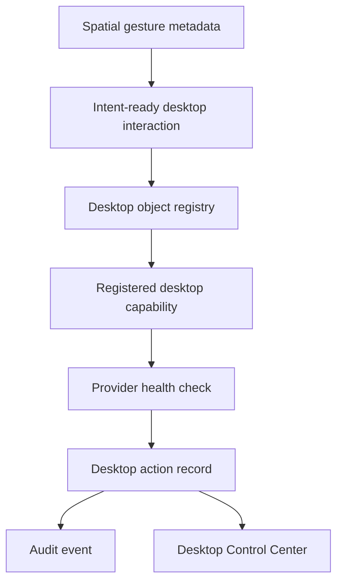

# Spatial Desktop Layer

Phase 14E extends spatial interaction beyond the dashboard by introducing a
governed desktop-object model. It does not directly control macOS. Every
desktop interaction remains routed through the Intent Engine and Desktop
Capability Layer, with policy, approval, audit, trusted-device, private-network,
and emergency-stop controls preserved.

## Implemented components

- `DesktopObjectRecord`: registered spatial targets for applications, windows,
  dock items, panels, notifications, workspaces, browser tabs, and related
  desktop objects.
- `DesktopProfileRecord`: interaction profiles such as development,
  presentation, meeting, productivity, accessibility, and custom modes.
- `DesktopOverlaySettingsRecord`: configurable overlay metadata for rays,
  cursors, highlights, and gesture labels.
- `DockItemRecord`: spatial dock entries for applications, workflows, commands,
  agents, and workspaces.
- `DesktopPanelRecord`: floating panel metadata for system status, agents,
  clipboard, notifications, workflows, and commands.
- `DesktopNavigationHistoryRecord` and `DesktopMetricRecord`: auditable
  histories and metrics for spatial desktop interaction quality.
- `POST /api/desktop/spatial/interactions`: records a spatial desktop
  interaction as a governed desktop action.

## Flow

Metadata-safe inspection can complete when the target binds to
`desktop.context.read`. Provider-required operations, such as registered
application activation or window movement, remain unavailable until a reviewed
healthy provider exists. High-risk or mutating actions remain approval-gated.

## Security boundary

The Spatial Desktop Layer never exposes:

- raw OS cursor movement;
- raw keyboard injection;
- unrestricted AppleScript;
- unrestricted Accessibility APIs;
- arbitrary shell execution;
- arbitrary executable paths;
- direct application launch;
- direct window manipulation.

Spatial desktop payloads are schema-validated and reject raw automation keys.
The layer stores bounded metadata only and records whether direct OS control is
available. That value must remain `false`.

## Dashboard

The Desktop Control Center now shows:

- registered desktop objects;
- active spatial profile;
- overlay settings;
- spatial dock and floating panels;
- desktop navigation history;
- desktop spatial metrics;
- explicit direct-OS-control denial flags.

The dashboard is an inspection and governed-request surface, not a privileged
control panel.
