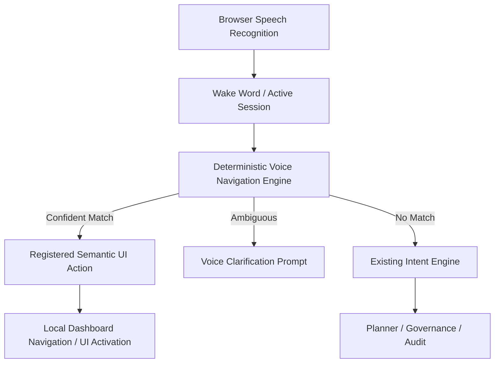

# Deterministic Voice Navigation Engine

Phase 16A adds a fast browser-side voice navigation layer in front of the
existing Voice OS and Intent Engine.

The goal is to handle common interface commands deterministically:

- “Open Commands”
- “Create command”
- “Go home”
- “Scroll down”
- “Go back”
- “Click Save”
- “Close”
- “Search”
- “Stop listening”

Only commands that cannot be confidently handled by the deterministic parser are
escalated to the existing Intent Engine.

## Runtime flow

## Continuous listening

After the user says “Alexa,” the runtime opens a short navigation session. During
that session, follow-up commands do not need to repeat the wake word. The session
is extended as commands are received and ends when the user says “stop
listening,” presses Stop, pauses the runtime, or the browser loses microphone
permission.

## Semantic registry

The engine reuses the existing Spatial UI registry:

- registered controls expose `data-spatial-id`
- labels come from `data-spatial-label`
- roles come from `data-spatial-type`

The parser may also use explicit accessible labels on ordinary controls. It does
not inspect arbitrary page text as authority, and it does not interact with
unregistered privileged desktop objects.

## Deterministic first, AI second

The deterministic parser handles:

- built-in page navigation
- scrolling
- history navigation
- simple registered UI activation
- dialog close/dismiss
- search focus
- voice session stop/pause

Unknown or complex requests are routed to the existing Intent Engine. This keeps
routine interface control fast while preserving the governed planning path for
tasks that need reasoning.

## Security boundary

Voice navigation is dashboard UI control only. It does not:

- approve actions
- run desktop capabilities
- call shell commands
- control macOS
- bypass policy, approval, audit, CSRF, trusted-device, or emergency-stop
  systems

Privileged work remains governed by the existing architecture.
